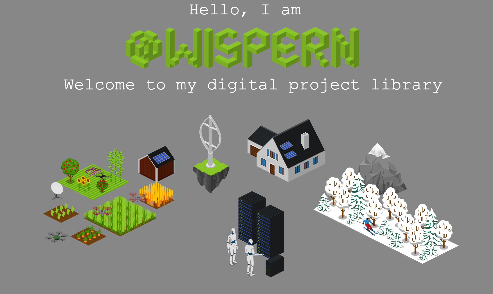

## About me
 

I am a software developer from switzerland.

###

**Personal interests**
- Embedded systems
- Hardware programming
- Web development
- HPC

###

**Currently working on**

Autonomus Drones: Autonomous TPP drone pilot

MCXN 947: Real time voice keyword search

###

###

## Previous Projects
 

[gRPC-Web-Frontend](https://github.com/WhisperN/gRPC-Web-Frontend) & [Go-Flight-Server](https://github.com/WhisperN/Go-Flight-Server) an experiment to transfer large scale data from a server to a client system via Google remote procedure calls. The backend is written in Go and utilizes the duckdb as a large scale data storage. The frontend implements WebAssembly and WebGPU for fast data processing

_Interactive Data Analysis_ a server and client that test multiple compute piplelines including large scale data transfer. In the network h1 and h2 is compared. For computations I use WebAssembly, WebGPU and plain JavaScript. The backend includes some computation written in Python with numpy.
Key findings: h1 or h2 does not make a diffrence. For the frontend WASM performed the best and for speed optimization it is best to compute on the server side.

[AstroidsPygame](https://github.com/WhisperN/AstroidsPygame) a fun little Astroids game written in python.

###

###

